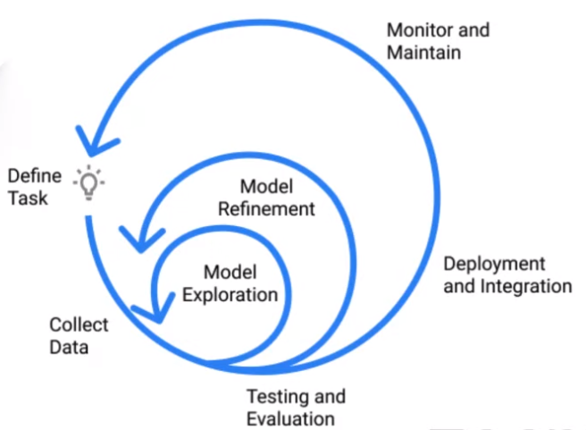

Follow this tutorial to try to use DVC [repo](https://github.com/iterative/magnetic-tiles-defect)

# Content
- Cumputer Vision (CV) Projects & Their Challenges
- Overview of the Demo Solution
- Data Versioning
- ML Pipelines and Experiment Management
- Leveraging CI/CD and Cloud Resources
- Summary

## Challenges of CV Project
- Data Management
    - Collection, labeling, storage, and versioning
- Model Training & Compute
    - expertise and hardware requirements
- Deployment Management
    - environments, dependencies, scaling, monitoring

# ML Project Lifecycle

# DVC
- ML Pipelines
- Data Versioning
- Experiment Management
- Dependencing graphs are key to understand what dependencies exist in our data;

# CML
- GitFlow for ML
- Auto reporting for PRs/MRs
- Integration with Cloud Services
